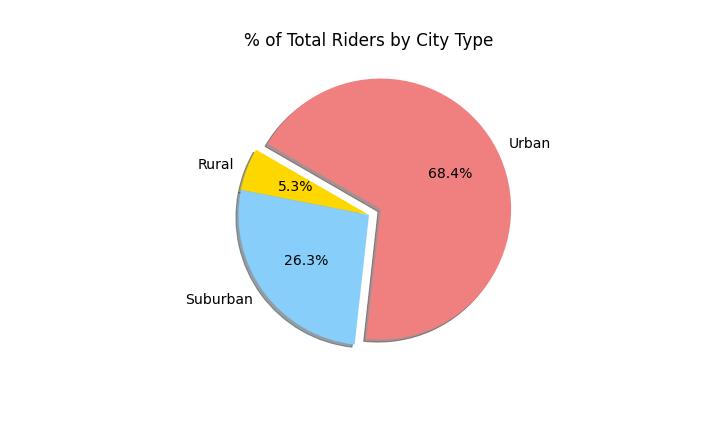

# PyBer_Analysis Report
##  An ETL process of a ridesharing in urban, suburban and rural cities to help enhance a ride-sharing service.

### Purpose
Pyber is a ride-sharing company that is seeking to improve ride sharing services by analyzing large amounts of data in csv format and determining the relationship between the type of city, number of drivers, number of riders and fares.  The analysis could help develop a strategy in enhancing ride-sharing services and determine affordability in underserved neighborhoods.  Two types of large data files were analyzed which contained:
* City type (Urban, Suburban, Rural)
* Number of drivers in each city
* Names of cities
* Dates of ride
* Fares

### Technical Analysis
An exploratory analysis was performed to screen the two datasets to provide an insight of the average fare of ride sharing.

Statistical analysis was later performed to provide rider count, ride fare and driver counts information.

If we compare the average number of rides between each city type, we’ll notice that the average number of rides in the rural cities is about 4 and 3.5 times lower than that in the urban and suburban cities, respectively.

The revenue from ride-sharing indicate that urban cities are over 60% of the business.  

The urban cities have 70% of the total riders and the rural cities have only 5% of the riders.

The percentage of drivers in urban cities is 80% indicating higher competition for the business.

### Summary
The summary of the DateFrame provides a snapshot of
* total riders
* total drivers
* total fares
* average fare per rider
* average fare per driver

in each of the City types (Urban, Suburban and Rural).

The average fare per driver in Urban cities is 2.5 to 3.5 times less than that in Suburban cities and Rural cities respectively.  The analysis indicates that there could potentially be more opportunity in the Suburban and Rural cities.
The multiple-line total weekly fare by city type over the first 4 months of the year 2019 indicates that there is an increase in business in all the city types during the third week of February.  It may be due to certain events particularly in certain cities during this time.  Additional analysis may be performed to identify the uplift in the business during this time.   Additionally, in the month of April, the suburban cities see an overall increase in total fares.

##  Challenges Encountered During the Analysis

### Image File Creation
The challenge encountered in this analysis is to be able to make an image file from the summary of the DataFrame.  To overcome this challenge, a screen print of the DataFrame was made and saved as an image file. 

## Recommendations and Next Steps

### Additional Analysis
Based on the analysis, it is evident that there are more potential opportunities in the rural and suburban cities as the average fare per driver is significantly higher in these city types.  It appears that there is a requirement for more drivers in the rural and suburban cities.
Additional analysis incorporating the following would provide a deeper insight into the results and be able to identify further opportunities.
### Additional Analysis 1
* Per Capita Overview
The population of the cities could provide a per capita overview of riders and drivers.  It may help identify if there are opportunities to attract more drivers in rural and suburban cities and hence improve the affordability of the ride-sharing.
The approach should be analyze on a per capita usage and the per capita driver count by using the ratios of riders/population and drivers/population
### Additional Analysis 2
* Commute time
Based on the average commute time, it could help identify the habits of riders.  Do riders use ride-share for longer commutes or there is no relation to commute time?  Understanding this could help adjust fare calculating algorithms to attract riders in rural and suburban cities.
This could be performed by calculating the fare per distance or fare per time of ride.
